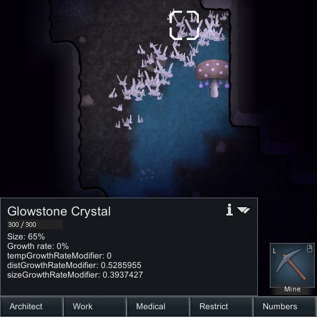
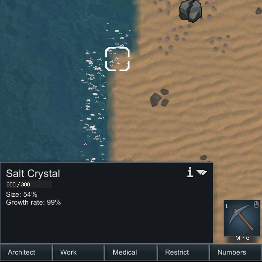
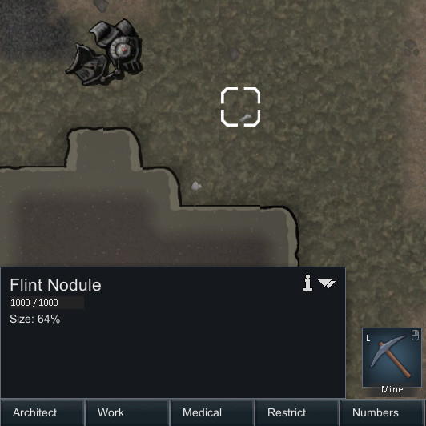
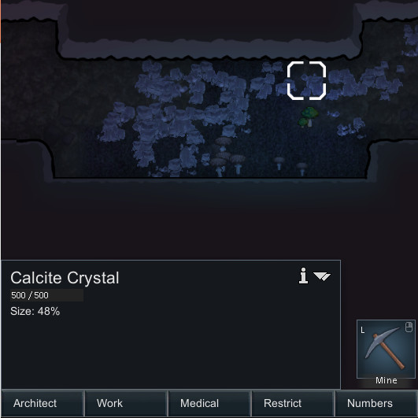
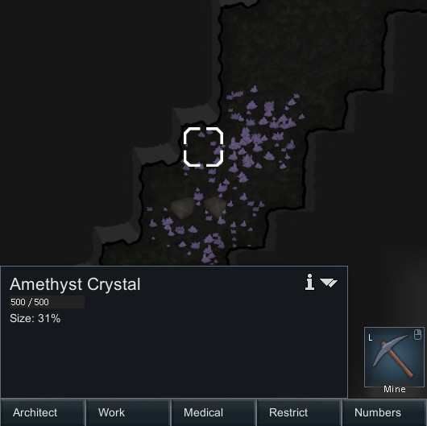

## Minerals: A rimworld mod for the [Hardcore SK project](https://github.com/skyarkhangel/Hardcore-SK)


This mod adds various mineral-related content.
For example, it adds various minable crystals underground, obsidian and flint for weapons, and living coldstone and glowstone crystals.


## Dynamic minerals

These spawn, grow, and shrink depending on conditions.

### Coldstone

An active deposit of coldstone. Grows slowly on cold bright days, but evaporates in the heat. Only found in permanently frozen terrain. Some glitterworld exobiologists belive these to be a kind of living crytsal since they seem capable of reproduction and they stress the need to safeguard these rare organisms. People on this rimworld however, tend to dig them up and use them to stop meat from spoiling.


### Glowstone

An active deposit of glowstone. Grows in wet hot places deep underground, but rarely active on the surface. Thought to be related in some way to the living deposits of coldstone in colder climates. They are prized by the native population for light sources, so there are few accessible deposits left in the more habitable parts of this rimworld.



### Salt

A deposit of salt formed by evaporation of nearbly salt water. Grows quickly on hot sunny days, but dissolves in the rain or incomming tides. Only persists in dry climates. Can be harvested to preserve food.




### Ice Stalagmites

Spawns in caves when water drips down from the ceiling and freezes. Only grow when the temperature is just below freezing and melts when the temperature rises.


## Static minerals

These are randomly spawned when a map is created and are never respawned in a given map.

### Obsidian

A volcanic glass formed when lava cools quickly at the surface. Valued by the tribal inhabitants of this rimworld for making knifes, handaxes, and arrowheads.
It only occurs on basalt.


### Flint

Formations of microcrystalline silicon dioxide found in sedimentary rocks. Valued by the tribal inhabitants of this rimworld for making knifes, handaxes, and arrowheads.



### Calcite

Crystals of calcium carbonate. A common mineral found underground, particulary in limestone caves. Interesting, but not otherwise very useful. Yeilds rubble if mined.




### Quatrz

Crystals of silicon dioxide, the same material glass is made of. A common mineral found underground. Yeilds glass batch when mined. Once in a while a gem-quality peice might be found.


### Amethyst

Crystals of silicon dioxide. Impurities of iron make these crystals a beautiful purple. A common mineral found underground. Yeilds glass batch when mined. Sometimes a gem-quality peice might be found.




### Citrine

Crystals of silicon dioxide. Impurities of iron make these crystals a beautiful yellow. Rarely found. Yeilds glass batch when mined. Often yeilds gem-quality peices due to its interesting color.


### Prasiolite

A very rare and beautiful green variety of quartz, silicon dioxide. Yeilds glass batch when mined. Often yeilds gem-quality peices due to its interesting color.


### Pyrite

Crystals of iron(II) disulfide. A common mineral found underground and often mistaken for gold or silver by the foolish. Interesting, but not otherwise very useful. Yeilds rubble if mined.


### Tourmaline group

Boron silicates with many chemical variations. The more attractive varieties are often used for gemstones and are therefore only found in regions difficult to access or live in. Found in granite and marble.


## Cutting gems

Some gem-quality crystals can be found when mining some minerals.
These can be cut into gems to be used for some crafting recipes or sold to traders.
Gems are particularly light and valuable, making them excellent for trading and attracting raiders.  


## Obsidian/Flint crafting

Flint and obsidian can be used to make "tribal" tools like knives and handaxes.
They have decent armor penetration, but are very brittle, so tools will get destroyed often when used for self defense.
Flint and obsidian arrows are better than standard stone arrows but not as good as metal arrows.


## Installation

You can download the current development version by clicking the green "clone or download" button near the top of this page. You can also download specific "stable" releases [here](https://github.com/zachary-foster/Minerals/releases), although they will probably not be updated too often. Once you have downloaded the mod, uncompress the file and up the foler in the `Mods` folder of you rimworld installation.

## To xml modders and potential contributers:

This mod is set up so that new minerals, both static and dynamic, can be added and configured using only XML changes.
Adding:

```
<ThingDef ParentName="StaticMineralBase">
		<defName>MyNewMineral</defName>
    ...
</ThingDef>
```

or

```
<ThingDef ParentName="DynamicMineralBase">
		<defName>MyNewMineral</defName>
    ...
</ThingDef>
```

to an XML file in `Defs/ThingDefs_Minerals` will cause a new mineral to be added to the game.

To add a mineral: 

* Copy the `ThingDef` for an existing mineral that is most similar to the one you want to make. Modify the XML how you want and add it to an XML file in `Defs/ThingDefs_Minerals`. Make sure to change the `defName`.
* Create textures for the new mineral and add to them to `Textures/Things/Mineral` in the same format as the others there.
* If you want to have you changes added to this mod for others to use, consider [forking](https://help.github.com/articles/fork-a-repo/) this repository and submitting a [pull request](https://help.github.com/articles/about-pull-requests/). I welcome contributions!

## Image sources used

I based some of the textures off of images with licenses for non-commercial reuse.
Here are the list of images used:

* Rob Lavinsky, iRocks.com – CC-BY-SA-3.0 [link](https://commons.wikimedia.org/wiki/File:Elbaite-Quartz-Albite-164061.jpg)
* Rob Lavinsky, iRocks.com – CC-BY-SA-3.0 [link](https://commons.wikimedia.org/wiki/File:Elbaite-Lepidolite-Quartz-gem7-x1c.jpg)
* Didier Descouens – GNU 1.2 [link](https://commons.wikimedia.org/wiki/File:Selpologne.jpg)
* Piotr Sosnowski – GNU 1.2 [link](https://commons.wikimedia.org/wiki/File:Halite-crystals2.jpg)
* Tjflex2 of flickr - CC-BY-SA-3.0 [link](https://www.flickr.com/photos/tjflex/358359211)
* https://www.maxpixel.net/Crystal-Jewelry-Clear-Quartz-Value-2187139
* https://www.flickr.com/photos/31856336@N03/3108675089
* https://commons.wikimedia.org/wiki/File:Sapphire_Gem.jpg
* https://commons.wikimedia.org/wiki/File:Cornflower_blue_Yogo_sapphire.jpg
* https://commons.wikimedia.org/wiki/File:Black_obsidian.JPG
* https://commons.wikimedia.org/wiki/File:Different_rocks_at_Panum_Crater.jpg
* https://pixabay.com/en/obsidian-stone-volcanic-rocks-glass-505333/
* https://www.flickr.com/photos/jsjgeology/36696371493
* https://commons.wikimedia.org/wiki/File:Egyptian_flint_knives,_predynastic._Wellcome_M0016545EB.jpg
* https://commons.wikimedia.org/wiki/File:Native_tribes_of_South-East_Australia_Fig_14_-_Stone_axe.jpg
*  https://github.com/Rikiki123456789/Rimworld/tree/ab7930661284c19e5dc4b9b01f2499bd88116378/CaveBiome/CaveBiome
* https://commons.wikimedia.org/wiki/File:Pyrite-Tetrahedrite-Quartz-184642.jpg
* https://commons.wikimedia.org/wiki/File:Pyrite-258273.jpg
* https://commons.wikimedia.org/wiki/File:2780M-pyrite1.jpg
* https://it.wikipedia.org/wiki/File:Una_mazza_Maquahuitl.jpg
* https://commons.wikimedia.org/wiki/File:Elbaite-Lepidolite-Quartz-gem7-x1a.jpg
* https://www.flickr.com/photos/jsjgeology/31997092221
* https://commons.wikimedia.org/wiki/File:Schorl-181669.jpg
* https://commons.wikimedia.org/wiki/File:Quartz-Schorl-k-142a.jpg
* https://www.flickr.com/photos/orbitaljoe/5030069066
* https://commons.wikimedia.org/wiki/File:Tourmaline-164039.jpg
* https://commons.wikimedia.org/wiki/File:Tourmaline-34580.jpg
* https://commons.wikimedia.org/wiki/File:Elbaite-Lepidolite-Quartz-gem7-x1a.jpg